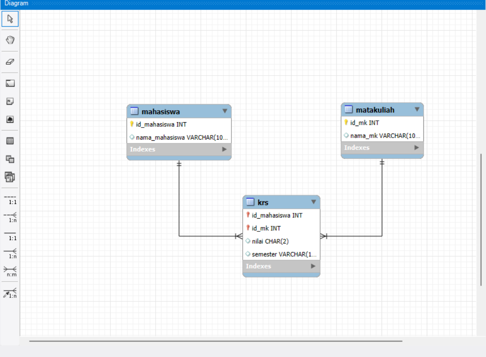
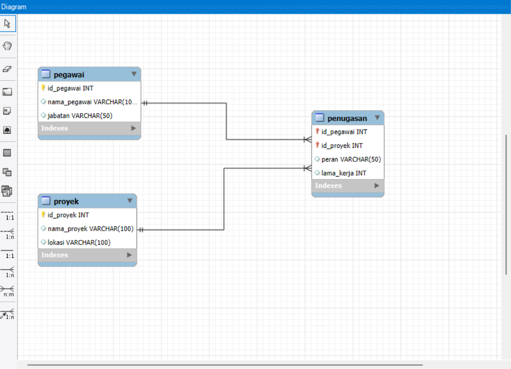
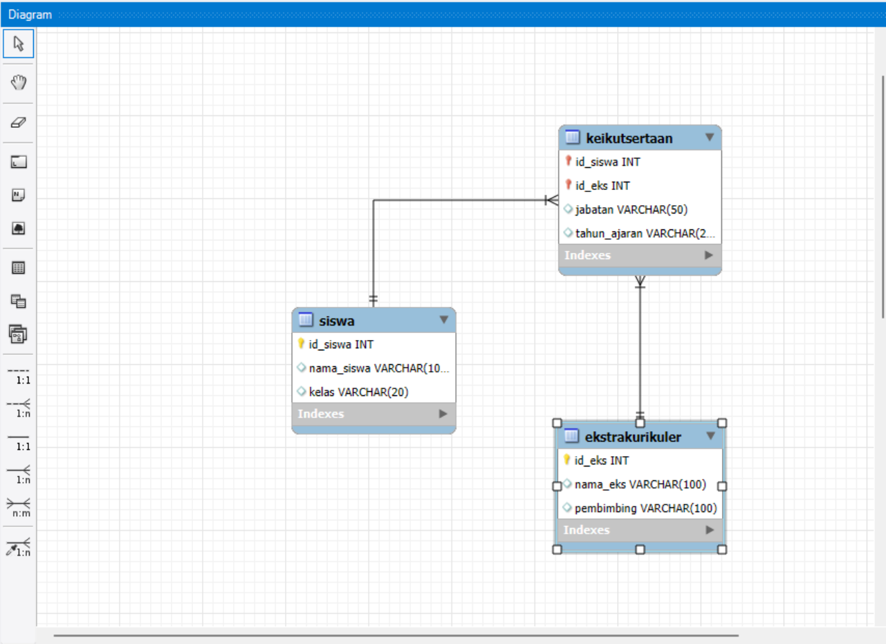
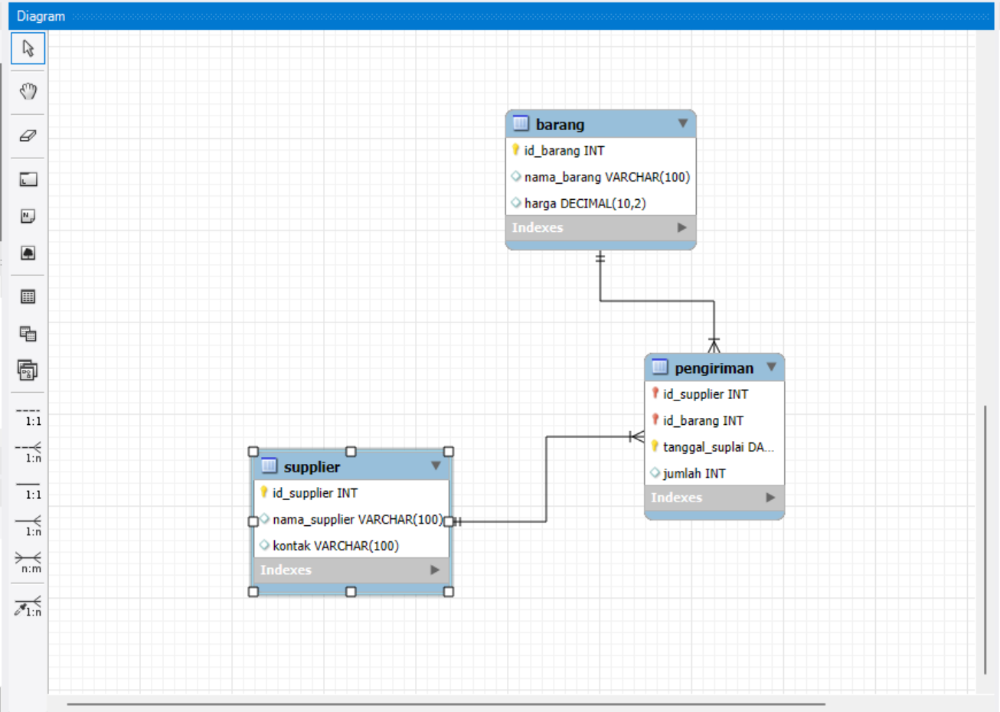

<html lang="id">
<head>
  <meta charset="utf-8" />
  <meta name="viewport" content="width=device-width, initial-scale=1" />
  <title>Blog Basis Data — Sonia Kemala Putri</title>
  
</head>
<body>
  

    <header>
      

        
      

      

        <h1>SONIA KEMALA PUTRI</h1>
        
Mahasiswa Teknik Informatika — Universitas Buana Perjuangan Karawang

        

          
NIM : 24416255201103

          
if24.soniaputri@mhs.ubpkarawang.ac.id

          
Basis Data

        

      

    </header>

      <article class="post">
        <h2>Post 1 : Contoh 5 Kasus Intersection</h2>
        <h3>Mahasiswa mengambil Mata Kuliah</h3>
        

          
          
Gambar: Contoh relasi tabel dengan Primary Key dan Foreign Key

        

        
        <h3>Pegawai mengikuti Proyek</h3>
        

          
          
Gambar: Contoh relasi tabel dengan Primary Key dan Foreign Key

        

        
        <h3>Siswa mengikuti Ekstrakurikuler</h3>
        

          
          
Gambar: Contoh relasi tabel dengan Primary Key dan Foreign Key

        

        
        <h3>Supplier menyuplai Barang</h3>
        

          
          
Gambar: Contoh relasi tabel dengan Primary Key dan Foreign Key

        

        
        <h3>Dokter melayani Pasien</h3>
        

            <iframe src="https://www.youtube.com/embed/SqyUI_sog28?si=nZSIy1HMOrnWq6iJ" 
            title="YouTube video" allowfullscreen></iframe>
        

    <article class="post">
        <h2>Post 2: Apa Itu Normalisasi pada ERD?</h2>
        
<strong>Normalisasi</strong> adalah proses penyusunan tabel dalam database agar data tersimpan dengan efisien dan tidak terjadi pengulangan (redundansi).
            Proses ini dilakukan setelah pembuatan ERD (Entity Relationship Diagram) untuk memastikan bahwa setiap data ditempatkan pada tabel yang tepat dan saling terhubung secara logis.
 
        <ul>
           Tujuan utamanya adalah <strong>agar struktur database lebih rapi, konsisten, dan mudah dipelihara.</strong>
        </ul>
    </article>

    <footer>
      © 2025 Blog Basis Data | <a href="https://www.ubpkarawang.ac.id" target="_blank">UBP Karawang</a>
    </footer>
